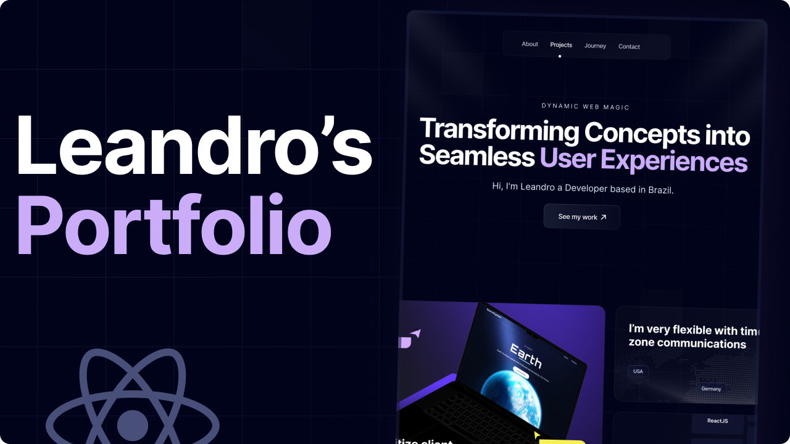

# 🌐 Leandro Kolosque – Portfolio

<p align="center">
  
</p>

[]()
[]()
[]()

---

## 📖 Descrição

Meu portfólio pessoal desenvolvido para apresentar meus projetos, habilidades e trajetória na área de desenvolvimento.  
Construído com foco em **performance, acessibilidade e experiência do usuário**, utiliza **React, Vite e TailwindCSS** para um design moderno e responsivo, além de **Framer Motion** para animações suaves.

---

## 🚀 Recursos Principais

- **Design Responsivo:** otimizado para diferentes dispositivos.  
- **Animações Fluidas:** transições criadas com Framer Motion.  
- **Performance e Escalabilidade:** construído com Vite e TypeScript.  
- **Organização de Projetos:** apresentação clara dos trabalhos desenvolvidos.  
- **Contato Direto:** links para redes e e-mail.

---

## 🛠️ Tecnologias Utilizadas

- **React + Vite** – estrutura moderna para aplicações rápidas.  
- **TailwindCSS** – estilização eficiente e altamente customizável.  
- **Framer Motion** – animações suaves e performáticas.  
- **TypeScript** – código mais seguro e escalável.

---

## 🌐 Acesse Online

O portfólio está hospedado e disponível para visualização:  
👉 [Clique aqui para acessar](https://kolosque.me/)  

Ou, se preferir, escaneie o QR Code:

  

---

## 🔧 Como Executar Localmente

```bash
# Clone este repositório
git clone https://github.com/Leandro-Kolosque/Portfolio

# Acesse a pasta do projeto
cd portfolio

# Instale as dependências
npm install

# Execute o projeto em ambiente de desenvolvimento
npm run dev
```
---

## 🤝 Contribuição & Feedback

Contribuições são sempre bem-vindas!  
Caso tenha sugestões de melhorias, otimizações de código ou novas ideias para o portfólio, fique à vontade para:

- Abrir uma **issue** aqui no repositório.  
- Enviar um **pull request** explicando detalhadamente as alterações.  

Feedbacks também são muito valiosos — se achar que algo pode ser mais performático ou visualmente atraente, compartilhe!

---

## 📬 Contato

**Leandro Kolosque**  
[GitHub](https://github.com/Leandro-Kolosque) <br>
[LinkedIn](https://www.linkedin.com/in/Leandro-Kolosque/)  <br>
[Email](mailto:leandro.wingerth@gmail.com)  <br>

---

## 🙏 Agradecimentos

Agradecimento especial à comunidade de desenvolvimento e aos criadores de ferramentas open source que tornaram possível a construção deste portfólio.

---

## 📄 Licença

Este projeto está licenciado sob a **MIT License** — veja o arquivo [LICENSE](LICENSE) para mais detalhes.
